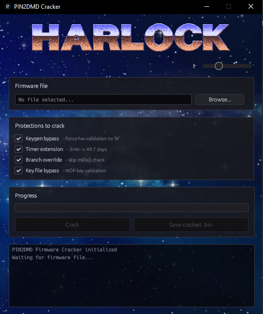

[🇬🇧 version anglaise](https://github.com/Game-K-Hack/pin2dmd-cracker/blob/master/README.md)

## PIN2DMD: Reserved for Enthusiasts Only

The "PIN2DMD" project was born out of passion. It was locked down because of dishonorable profiteers who plundered free work to line their pockets at the community's expense.

My position:
- Total respect for Lucky1 and Steve45. Their anger is completely justified.
- Absolute contempt for those who sell what belongs to everyone.
- This repo is for enthusiasts, not for thieves.

If you are making money off the backs of volunteers, go fuck yourselves.

### STRICTLY NON-COMMERCIAL USE: LEGAL WARNING

This project is exclusively intended for private enthusiasts. Any commercial exploitation, resale, or integration of this crack into machines sold for profit is strictly prohibited. If you use this work to make money, you expose yourself to heavy legal consequences:

🇫🇷 Risks in France

- Counterfeiting *(Art. L335-2 of the CPI)*: Selling products resulting from counterfeiting is punishable by **3 years in prison and a €300,000 fine**.
- DADVSI Law *(Art. L335-3-1 of the CPI)*: Knowingly bypassing a technical protection measure or providing others with the means to do so is a criminal offense. For resellers, fines are heavy and can be added to counterfeiting penalties.

🇺🇸 Risks in the United States (US Law)

- Copyright Act *(17 U.S.C. § 506)*: Willful infringement for commercial profit can lead to up to **5 years in prison**.
- DMCA (Statutory Damages): U.S. courts can award up to **$150,000 per infringement** (per copy sold). The US does not mess around with profiting from intellectual property.

If you use this work to make money, you are exposing yourself to international prosecution. You are solely responsible for your own shit when facing justice.

### Visual

