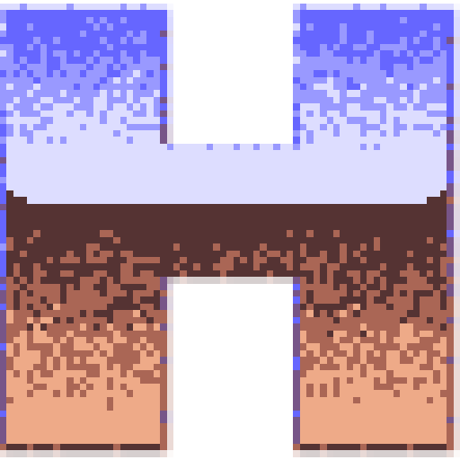

    

 

  
  
  

 
 

[🇬🇧 version anglaise](https://github.com/Game-K-Hack/pin2dmd-cracker/blob/master/README.md)

## PIN2DMD : Réservé seulement pour les passionés

Le projet "PIN2DMD" est né de la passion et il a été verrouillé à cause de profiteurs sans aucun honneur qui ont pillé un travail gratuit pour s'engraisser sur le dos de la communauté.

Ma position: 
- Respect total pour Lucky1 et Steve45. Leur colère est légitime.
- Mépris absolu pour ceux qui vendent ce qui appartient à tous.
- Ce repo est là pour les passionnés, pas pour les voleurs.

Si vous faites de l'argent sur le dos des bénévoles, allez vous faire foutre.

### USAGE STRICTEMENT NON-COMMERCIAL : AVERTISSEMENT LÉGAL

Ce projet est exclusivement destiné aux particuliers passionnés. Toute exploitation commerciale, revente ou intégration de ce crack dans des machines vendues à profit est strictement interdite. Si vous utilisez ce travail pour faire de l'argent, vous vous exposez à des poursuites lourdes:

🇫🇷 Risques en France

- Contrefaçon *(Art. L335-2 du CPI)* : La vente de produits issus de la contrefaçon est punie de **3 ans d'emprisonnement et 300 000 € d'amende**.
- Loi DADVSI *(Art. L335-3-1 du CPI)* : Le fait de contourner sciemment une mesure technique de protection ou de proposer à des tiers des moyens de le faire est un délit. Pour les revendeurs, les amendes sont lourdes et peuvent s'ajouter aux peines de contrefaçon.

🇺🇸 Risques aux États-Unis (US Law)

- Copyright Act *(17 U.S.C. § 506)* : L'infraction volontaire pour profit commercial peut entraîner jusqu'à **5 ans de prison**.
- DMCA (Statutory Damages) : Les tribunaux américains peuvent accorder jusqu'à **150 000 $ par infraction** (par copie vendue). Les USA ne plaisantent pas avec le profit sur la propriété intellectuelle.

Si vous utilisez ce travail pour faire de l'argent, vous vous exposez à des poursuites internationales. Vous êtes seuls responsables de votre merde face à la justice.

### Visuel

